# Multi-Strategy Alpha Book

[](https://github.com/Morwane/multi-strategy-alpha-book/actions/workflows/ci.yml)

> Combining **decorrelated alpha sleeves** into one risk-managed book via inverse-volatility **risk parity** — the diversification "free lunch" in action. Built on LSEG-data strategies, look-ahead-free, vol-targeted.

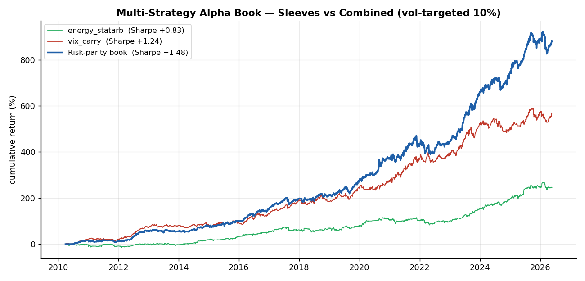

## Why this project matters

A single strategy, however good, has its own risk and its own bad regimes. The way real multi-strategy desks build robust returns is by **stacking weakly-correlated alpha sources** and allocating risk across them. This repo is the **allocation layer** that does exactly that.

It combines two standalone sleeves I built:

| Sleeve | What it harvests | Repo |
|--------|------------------|------|
| `energy_statarb` | mean-reversion of the 3:2:1 crack & Brent-WTI spreads | [energy-spreads-statarb](https://github.com/Morwane/energy-spreads-statarb) |
| `vix_carry` | the variance risk premium via the VIX-futures roll | [vix-vol-carry](https://github.com/Morwane/vix-vol-carry) |

Their returns are **almost perfectly uncorrelated (ρ = +0.03)** — one trades petroleum spreads, the other equity volatility. That orthogonality is what makes the combination powerful.

## Key result — the diversification free lunch

(2010–2026, vol-targeted to 10% annual)

| Strategy | Sharpe | CAGR | Max DD | Calmar |
|----------|:------:|:----:|:------:|:------:|
| energy_statarb (sleeve) | +0.83 | +8.1% | −16.8% | +0.48 |
| vix_carry (sleeve) | +1.24 | +12.6% | −10.4% | +1.22 |
| Equal-weight | +0.93 | +9.2% | −15.3% | +0.60 |
| **Risk-parity book** | **+1.48** | **+15.4%** | −14.3% | +1.07 |

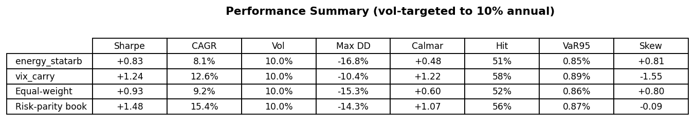

> The combined book's **Sharpe (1.48) exceeds the best single sleeve (1.24)** — the hallmark of genuine diversification. Risk parity also beats naive equal-weight (1.48 vs 0.93) by sizing each sleeve to contribute equal risk.
>
> _Note on samples: this headline is the **full 2010–2026** sample. The regime-overlay and robustness sections below use a stricter **out-of-sample 2013–2026** window (HMM needs a training burn-in), where the static risk-parity book scores **1.43** — the benchmark those sections compare against._

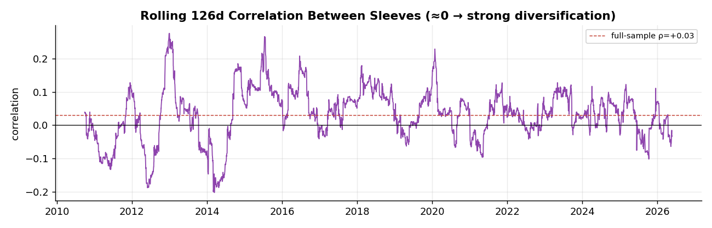

## Method

- **Inputs** — daily return streams of the two sleeves (`data/components/components.csv`).
- **Risk parity** — weights `∝ 1/volatility` from **trailing 63d** vol, `shift(1)` (no look-ahead).
- **Vol targeting** — the book is scaled to 10% annual vol for interpretable risk.
- **Benchmark** — naive equal-weight, to show risk parity adds value.

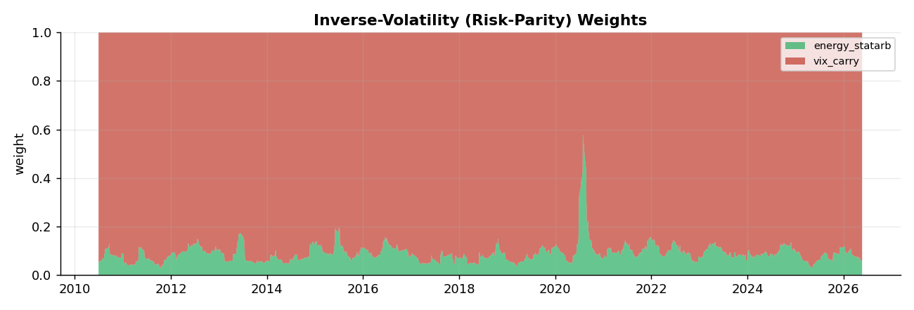
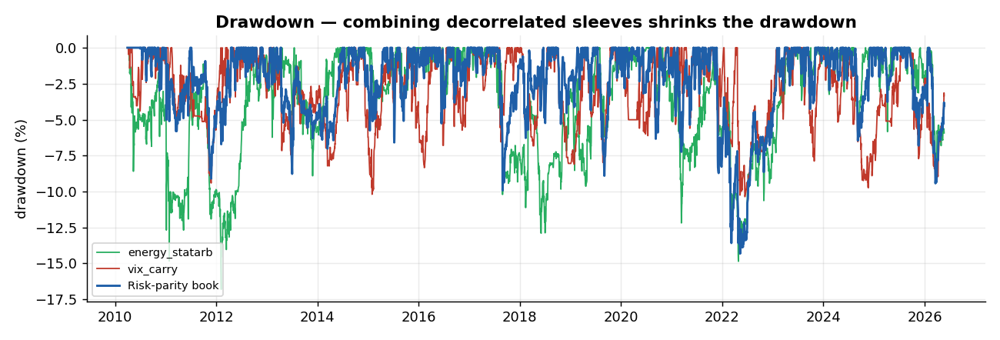

## Risk controls & robustness

- Weights use **trailing volatility only**; they sum to 1; portfolio vol-targeted.
- **Subperiod robustness** across four regime eras; automated `quant_checks` + a `pytest` suite (11 tests).

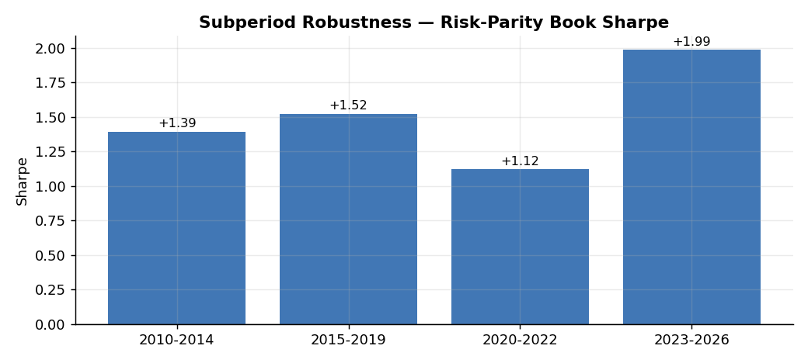

## Limitations

- Sleeve returns are vol-normalized **research** PnL, not sized dollar books.
- Risk parity uses volatility only (not the full covariance / tail dependence); correlations can rise in crises.
- Research only — **not investment advice**.

## Regime-aware overlay — does HMM regime detection add value?

On top of the static book sits a **walk-forward Hidden Markov Model** that detects
market regimes (calm / normal / stress) from LSEG macro-market data, and an
allocation layer that reacts to them. The honest question: **does conditioning on
regime beat simply running risk parity?**

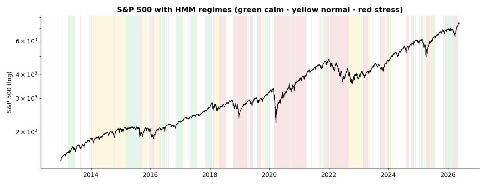

The 3-state Gaussian HMM is **refit quarterly on past data only**, standardised on
the train window only, decoded causally (Viterbi up to *t*), and relabelled to fixed
economic codes each refit (kills label-switching). Regime economics are clean: stress
carries ~2× the realised vol and VIX of calm, negative momentum and a flatter curve.

### The result (out-of-sample 2013–2026, net of 2 bps/turnover)

| Strategy | Sharpe | CAGR | Max DD | Calmar | Turnover/yr |
|----------|:------:|:----:|:------:|:------:|:-----------:|
| Risk-parity (benchmark) | +1.43 | +14.8% | −14.2% | +1.04 | — |
| Regime as **alpha-timing**, naive | +1.04 | +10.4% | −16.6% | +0.63 | 40.4 |
| Regime as **alpha-timing**, disciplined | +0.87 | +8.5% | −15.2% | +0.56 | 4.3 |
| **Regime as risk-throttle** | **+1.43** | +14.7% | **−10.3%** | **+1.43** | 1.7 |

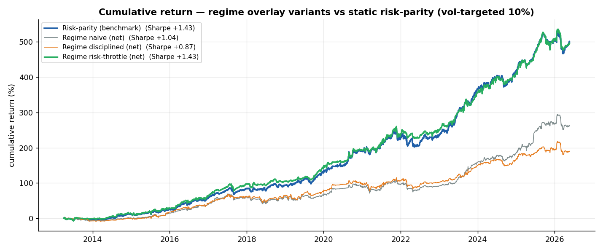

**Two findings, one lesson:**

1. **Regime as a return-timing signal destroys value.** Both the naive switch and a
   disciplined version (confidence gating + hysteresis + scheduled rebalancing, which
   cut turnover from 40× to 4×) **underperform** static risk parity. The switching lag
   — the *persistence trap* — and disturbing the diversification mix cost more than the
   timing earns.
2. **Regime as a risk-throttle adds value.** Keeping the proven risk-parity mix always
   on and using the regime *only* to cut gross exposure in confirmed stress keeps the
   same Sharpe (1.43) while **shrinking max drawdown to −10.3% (from −14.2%) and lifting
   Calmar by 38%**, at negligible turnover (1.7×/yr).

> **Lesson:** here, HMM regime detection is a risk-management tool, not a return-timing
> signal — exactly what a desk would conclude.

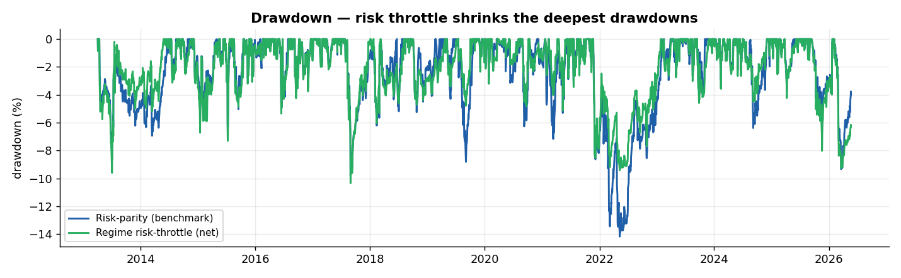

### Methodology (look-ahead-free by construction)

- **Data** — 13 daily LSEG series 2010–2026 (energy fronts + WTI curve, S&P 500, VIX
  complex, DXY, US 2Y/10Y yields), pulled once to `data/regime/raw_prices.csv`. Every
  series is **measured**; missing values are forward-filled over non-trading gaps only.
- **Features** — causal returns, realised vol 20/60d, rolling skew, drawdown, VIX level
  & change, VIX term structure, 2s10s slope, Brent-WTI, 3:2:1 crack, WTI curve slope.
- **HMM** — expanding-window quarterly refit; train-only standardisation; per-day causal
  Viterbi decode; economic relabelling from emission means.
- **Backtest** — weights decided on the *prior* day's regime (`shift(1)`); transaction
  costs charged on realised turnover; everything vol-targeted to 10% for fair comparison
  on the **same out-of-sample window**.

### Limitations

- Two sleeves only — the regime playbook is a 2-asset tilt + gross throttle, not a rich
  cross-sectional allocation. More sleeves (e.g. a momentum sleeve) would test the
  trend regime properly.
- The risk-throttle's edge is concentrated in drawdown control; it does not raise Sharpe.
- HMM regimes are descriptive, not causal; the playbook gross/threshold levels are
  judgment calls, kept deliberately simple to avoid overfitting.
- Research only — vol-normalised PnL, **not investment advice**.

Run it: `python scripts/run_regime_overlay.py` (needs the saved `raw_prices.csv`; to
re-pull data, `python scripts/pull_regime_data.py` with LSEG Workspace open).

## Robustness — does the result survive scrutiny?

Out-of-sample 2013–2026, vol-targeted 10%. Run: `python scripts/run_robustness.py`
(full appendix in [`reports/robustness.md`](reports/robustness.md)).

**1. Transaction-cost sensitivity** — allocation turnover is low, so the book is essentially cost-insensitive:

| Cost | 0 bps | 5 bps | 10 bps | 25 bps | 50 bps |
|------|:-----:|:-----:|:------:|:------:|:------:|
| Sharpe | +1.43 | +1.43 | +1.43 | +1.43 | +1.42 |

**2. Block-bootstrap (2000× resamples, 21-day blocks)** — the edge is not a fluke: risk-throttle Sharpe **90% CI [+1.01, +1.87]**, median +1.44, **P(Sharpe > 0) = 100%**.

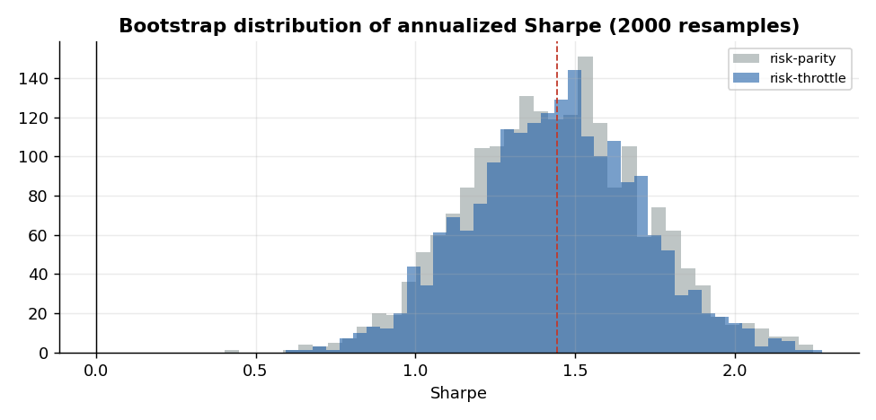

**3. Sleeve-correlation stability** — full-sample correlation +0.04; rolling 126-day correlation stays low (worst +0.27), so the diversification does **not** break down in stress (directly relevant to my thesis on correlation regimes).

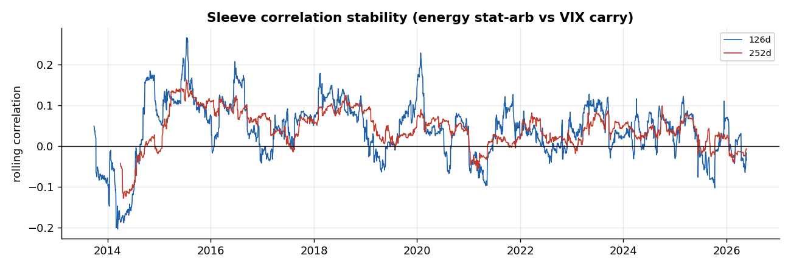

**4. Benchmark comparison** — the market-neutral book dominates passive allocations on risk-adjusted terms and especially drawdown:

| Strategy | Sharpe | CAGR | Max DD |
|----------|:------:|:----:|:------:|
| Risk-throttle book | **+1.43** | +14.7% | **−10.3%** |
| Risk-parity book | +1.43 | +14.8% | −14.2% |
| SPY | +0.71 | +11.2% | −36.1% |
| 60/40 (SPY/LQD) | +0.59 | +6.3% | −28.2% |

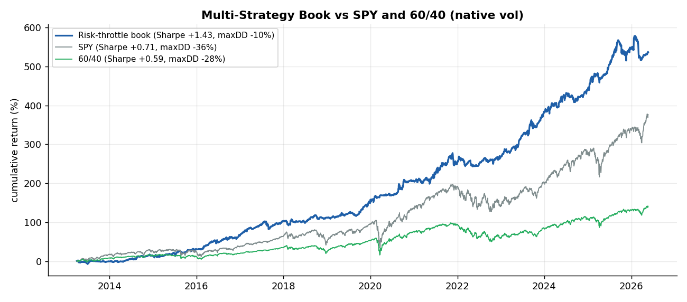

**5. Crisis stress tests** — being market-neutral, the book is flat-to-positive through every studied crisis (worst episode −2.6%), versus SPY −36% in COVID:

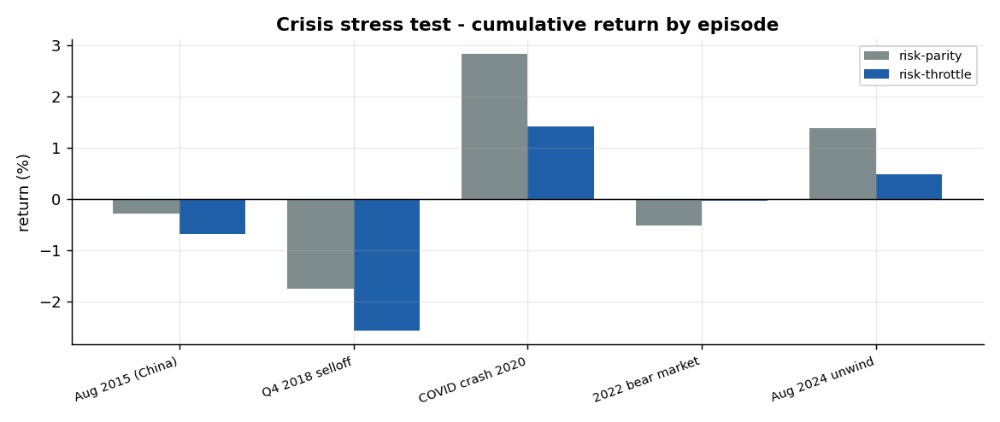

**6. Risk contribution** — under risk parity each sleeve carries ~equal risk (**energy 50% / VIX 50%**): risk is equalized, not capital. So neither sleeve secretly dominates the book.

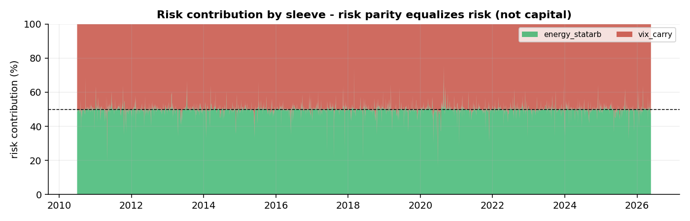

## Sleeve-addition study — a tested *negative* result

Before adding sleeves, I test whether they actually help. I built a **cross-asset trend (time-series momentum) sleeve** over **13 LSEG futures markets** (S&P/Nasdaq/Dow, UST 2Y/10Y/30Y + Bund, WTI/Brent/NatGas/gold/silver/copper) — blended 3/6/12-month trend, inverse-vol risk weighting, look-ahead-free.

| | Sharpe | corr to energy | corr to VIX |
|---|:---:|:---:|:---:|
| Trend sleeve (standalone) | **+0.03** | −0.06 | −0.01 |

| Risk-parity book (common window) | Sharpe | Max DD | Calmar |
|---|:---:|:---:|:---:|
| 2 sleeves (energy + VIX) | **+1.36** | −13.8% | +1.02 |
| 3 sleeves (+ trend) | +1.00 | −12.2% | +0.82 |

**Verdict: do not add it.** The trend sleeve is beautifully **decorrelated** (ρ ≈ 0 to both sleeves) — but its standalone Sharpe is ~0, so it **dilutes** the book. The reasons are honest and well-documented: 2010–2026 was the *"lost decade" for trend-following*, and 13 quasi-clustered markets (3 US-equity, correlated energy, correlated metals) give only ~4–5 independent bets vs the 50–100+ a real CTA runs.

**The lesson:** decorrelation alone is not enough — a sleeve must also carry a positive expected return. Testing and *rejecting* a plausible idea is part of the process. *(Run: `python scripts/pull_trend_universe.py` then `python scripts/trend_sleeve_analysis.py`.)*

## Repository structure

```
multi-strategy-alpha-book/
├── README.md · LICENSE · requirements.txt
├── data/components/components.csv   # sleeve return streams (from the two sleeve repos)
├── src/
│   ├── data.py        # load sleeves
│   ├── allocate.py    # equal-weight, risk parity, quant_checks
│   ├── metrics.py     # vol targeting + performance/risk metrics
│   └── plots.py       # figures
├── scripts/
│   ├── run_backtest.py
│   └── generate_report.py
├── tests/test_allocate.py
├── docs/assets/
└── reports/tearsheet.md
```

## How to run

```bash
pip install -r requirements.txt
python scripts/run_backtest.py        # allocation metrics + integrity checks
python scripts/generate_report.py     # figures + tearsheet
pytest -q
```

*Built with Python (pandas, numpy, matplotlib). Capstone of a multi-strategy volatility & relative-value research portfolio.*
